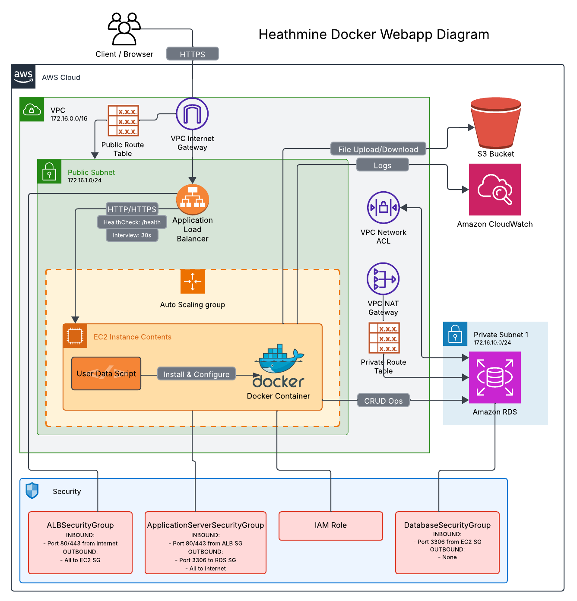

# Healthmine AWS Infrastructure Assessment

This repository contains my implementation of the Healthmine AWS infrastructure assessment, demonstrating a CloudFormation deployment of EC2 with Docker, RDS, and S3 components.

## Author

**Dylan Chambers** - DevOps & Cloud Engineering Professional

Specializing in infrastructure automation, CI/CD pipelines, and secure cloud architecture.
Currently pursuing Certified Kubernetes Administrator and AWS Cloud Practitioner certifications.

Connect with me:
- [LinkedIn](https://linkedin.com/in/dchambers6222)
- [GitHub](https://github.com/dchambers6222)

## Assessment Summary

This project implements a CloudFormation template and supporting resources to provision:
- EC2 instances in an Auto Scaling Group running Docker containers
- Application Load Balancer for traffic distribution
- MySQL RDS database for persistent storage
- S3 bucket for file storage
- IAM roles, security groups, and network infrastructure



## Repository Structure

```
├── cloudformation/                     # CloudFormation templates
│   ├── main.yaml                       # Main stack template
│   └── params/                         # Parameter files
├── docs/                               # Detailed documentation
│   ├── architecture-design.md          # Architecture details
│   ├── deployment-guide.md             # Deployment instructions
│   └── configuration-details.md        # Configuration guide
└── scripts/                            # Helper scripts
    ├── user-data.sh                    # EC2 user data script
    └── test-connectivity.py            # Infrastructure testing script
```

## Documentation

- [**Architecture Design**](docs/architecture-design.md) - Detailed architecture explanation and diagrams
- [**Deployment Guide**](docs/deployment-guide.md) - Complete deployment instructions
- [**Configuration Details**](docs/configuration-details.md) - Design choices and technical decisions
- [**Project Plan**](PROJECT_PLAN.md) - Implementation plan with completed task checklist

## Technical Highlights

- **High Availability Design**: Multi-AZ deployment with Auto Scaling for resilience
- **Security First Approach**: Least privilege IAM roles and layered security groups
- **Infrastructure Testing**: Custom script for validating all infrastructure components
- **Comprehensive Documentation**: Detailed guides for architecture, deployment, and configuration

## Assumptions and Limitations

Key assumptions in this implementation:

1. **Network Configuration**: Uses public subnets for demonstration; private subnets recommended for production
2. **Security**: Open SSH access for testing purposes; would be restricted in production
3. **Docker Image**: Uses public demo image; would be replaced by application-specific image
4. **Full details**: See the [Configuration Guide](docs/configuration-guide.md) for comprehensive design decisions

## Assessment Requirements

The project implements all requirements specified in [ASSESSMENT_OBJECTIVE.md](ASSESSMENT_OBJECTIVE.md):

- ✅ Architecture diagram and detailed documentation
- ✅ CloudFormation template with EC2, RDS, S3, and security configurations
- ✅ Docker configuration via user data script
- ✅ Database configuration and setup
- ✅ S3 bucket with appropriate IAM policies
- ✅ Testing script for infrastructure validation